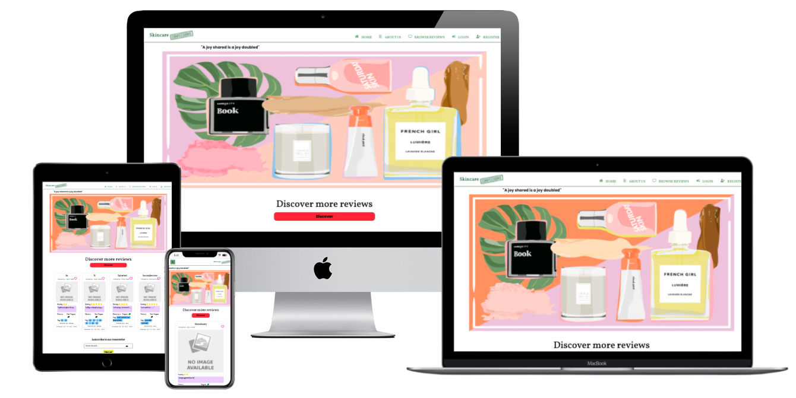
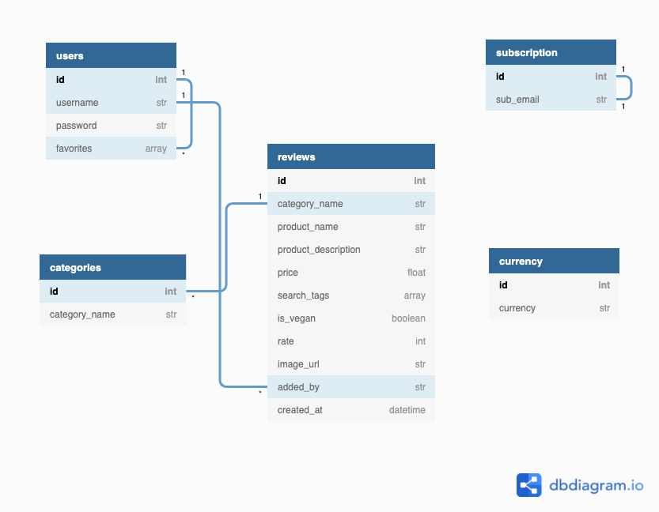
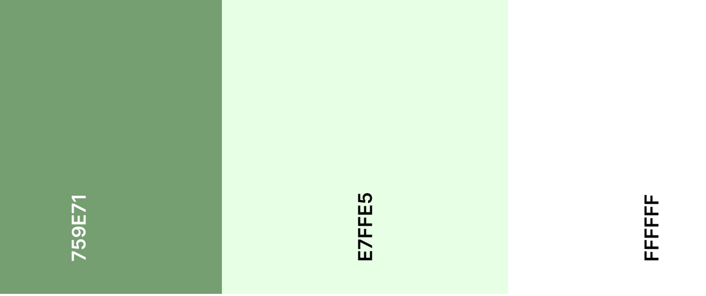
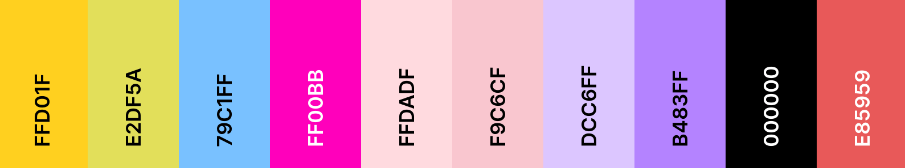
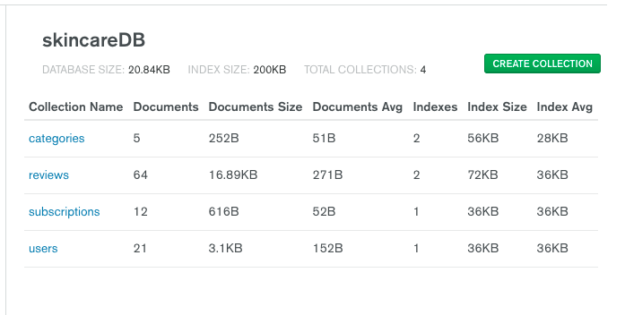

<link rel="stylesheet" href="https://use.fontawesome.com/releases/v5.6.1/css/all.css" integrity="sha384-gfdkjb5BdAXd+lj+gudLWI+BXq4IuLW5IT+brZEZsLFm++aCMlF1V92rMkPaX4PP" crossorigin="anonymous">
<h1 align="center">Skincare confessions</h1>



### Overview
_The aim of this project is to combine my current knowledge in HTML, CSS and JavaScript with what I've been able to learn from the back end development process of making an application. Main purpose of this project is to utilize Python programming language integrated with MongoDB and Flask framework, to create a database for storing and retrieving data efficiently. As such I have decided to create the following skincare review site, which allow users to create, read, update and delete (CRUD) reviews/data.
'Skincare confessions' is an open source application for all to use but would consider skincare and beauty enthusiasts the main target audience. Passionate to discover and explore new brands, share or perhaps keep track and store own favorite brands._

---
 ## User Experience 5 Planes (UX)
  ### The Strategy Plane
  - 'Skincare confessions' website is designed to be obvious its purpose with the user experience kept front-in-mind. A combination of modern and minimalist design approach with simple intuitive structure, making it easy for users to quickly adapt and allure them to keep coming back. The website application will be built with a mobile first approach because of its simplicity and light content also taking into consideration that the majority of our audience most likely will be browsing online using a smartphone device because of 21st century convenience.
  'Skincare confessions' enables access to all the reviews that's been published on the site even for non-registered users. With an additional function to subscribe to a newsletter keeping the user updated and engaged in what’s happening in the skincare community. At the same time however it gives the opportunity to create an account and benefit from the perks of having access to all features available on the website. Apart from being able to add, share, edit and delete their own reviews registered users are also able to save their favorite reviews.
  
- ### User stories ###

   - _"As a **user**, I'd like to effectively browse and read through posted reviews that I'd be keen to learn more about or even might purchase."_

   - _"As a **user**, I'd like to be able to create my own account
."_
   - _"As a **user**, I want to access the website from any device (mobile, tablet, laptop and desktop)"_

   - _"As a **user**, I want to review a product so that I can share my own experiences with others but also keep as reminder for self"_
 
   - _"As a **user**, I want to update a review if for instance I have made a spelling mistake or perhaps my opinion has changed."_
 
   - _"As a **user**, I'd like to be able to remove reviews I have created, if no longer relevant"_
 
   - _"As a **user**, I'd like to be able to quickly search the site to find a specific item."_
 
   - _"As a **user**, I'd like to categorize my entries to easier locate a specific item in case I forget the product name. _"

   - _"As a **user**, I'd like to mark reviews I want to preserve. _"

   - _"As a **user**, I want to be able to upload images of what I review, so that it is easier to associate the actual item with item name/description."_

- ### Site Owner Goals ###

    - _"As **site owner**, I want to connect like-minded individuals and give them the opportunity come together and share their experiences. "_

    - _"As **site owner**, I would like to collect users e-mail addresses for newsletters to expand the community."_
 
    - _"As **site owner**, I want to raise awareness of the organization and clarify its mission."_
 
    - _"As **site owner**, I want my application to become the number 1 search engine for skincare reviews."_

     - _"As **site owner**, I want a simple visually appealing application easy to use across various screen devices."_

     - _"As **site owner**, I want to drive public opinion to influence businesses to improve the services they offer and quality of their products."_

**Below is a table depiction of site feature opportunities evaluated in terms of importance for the organization and measuring of how realistic the features are to implement &#40;viability and feasibility&#41;. Measured on a scale of 1 &#91;least&#93; - 5 &#91;most&#93;.**

| Opportunity                                 | Importance | Viability / Feasibility |
| :------------------------------------------ | :--------: | :---------------------: |
| Create an Online Presence                   |     5      |            5            |
| Register                                    |     5      |            5            |
| Login / Logout                              |     5      |            5            |
| Create / Update / Delete Reviews            |     5      |            5            |
| Responsiveness                              |     5      |            4            |
| Search Reviews By Keywords                  |     4      |            5            |
| Show Reviews By Category                    |     4      |            5            |
| Subscribe To Newsletter                     |     4      |            4            |
| Manage Review Category &#40;Admin only&#41; |     3      |            5            |
| Page 404                                    |     3      |            5            |
| Image Upload For Each Review                |     4      |            2            |
| Pagination                                  |     3      |            3            |
| Rating of Reviews                           |     3      |            3            |
| “Like” Reaction on Reviews                  |     2      |            2            |
| Resetting Password When Users Forget It     |     5      |            2            |

### The Scope Plane

The essential functional specifications and content for the website which are outlined below were determined based on users and site owners wants and needs, so the site will deliver specific for its intended use. 

**Features & Content this project will include;**

- All pages
   - A simple navigation bar containing site overview list, allowing users to easily navigate across the different site pages. On smaller resolution devices such as mobile, tablet the navbar is collapsed into a burger drop down menu, providing a cleaner aesthetic and better user experience. A side bar navigation appears when the burger icon is clicked. 
   - Footer which features links to social media channels opening in new window tabs.

- Registration page which allows a user to create a personal account choosing username and password. Below the form is a link re-directing to the login page for existing users. For the account to be created, all fields must pass validation:
   - Username must be between 3 and 15 characters
   - Password must be at least 8 characters
   - Confirm password field should match the password field


- Login page features the form with "username" and "password" fields which must be filled and match the ones in the database to access users personal account. If entered inaccurately when submitted a flash message will display an error description, to alert user. A link below form will help re-direct already registered users to login page.

- Logout link button will end user session and redirect to the homepage.

- Subscription function collecting users e-mail addresses for users interested in receiving newsletter updates.

- Manage categories page for authorized admin use only, to create update and delete category list display.

- Create / Update / Delete functions;
   On users Add Reviews page is where personal reviews are created. Ones all the criterias on the validation form are meet the review can be added;

   - Product category of review must be selected 

   - Product brand that's being subject of the review is required, must be between 1 and 25 characters.

   - A Product description is required and must contain between 10 and 2000 characters.

   - Product cost will be required information
   
   - Reviews must be rated a score between 1 and 5 star icons.

   - There will be the option to upload an image. If a review is added without an image, a default image will be adapted.

   - Search tags will be optional to add 

   - On users My Review page they are able to view all their entries, would they however want to make a new entry then there will be an add button which would re-direct to the Add Review page. Otherwise if user wishes to make modifications there will also be an Edit button available which would re-direct user to their personal edit page, where same validation form as in add review page will be displayed. A message will appear confirming the success or failure of the update made. If a user wishes to delete their entry there will also be a delete button presented on the My reviews page, the review will only be deleted ones the user respond to the confirmation dialog box.

- Pagination will be another existing feature on the website as the community grows and the number of reviews increases this will improve the user experience. 

- 404 page that appears for invalid URL directing users back to Home page will be provided.

- Reset Password function that enables users who happen to forget their password the opportunity to re-new it.

- The informative content that will be present on the website are;
   - Text presentation about the web application and text description of each user review.
   - Images (hero image, logo, product images) will appear on site as well. 
   - Icons signalmen that provides predictability.

### The Structure Plane

The main focus of the structure plane is how users receive and get to specific information on the website.

- Using the navigation bar conveniently placed top of website, users can easily navigate the website to find what they are interested in. 

- For a more specific & quick search, on the Browse Reviews and My Reviews collection page users can also opt to use the search bar adapting keywords matching their specific quest.

- Pages available for public display are Home, Browse Reviews, Register and Login.

- To access full site features such as adding, updating and deleting own reviews also having access to a personal review collection page user will have to register and sign in.

- Note Admin user account has additional access to Manage Categories page.

-  To not overwhelm the user, text information is kept brief with focused content information. Attention grabbing and descriptive imagery objects also incorporated on the site (e.g logo). Connection points are provided via links to Social Media in Footer. 

- Page 404 that appears for invalid URL directing users back to Home page. Design structure similar to the other website components so that the layout remains consistent and user finds familiarity.

- Full description of a review post are accessible by any user on Review details page which renders when a user clicks on a post. 

Below is a chart of the database structure showing the collections that will be retaining documented data. 
> **Note:**<br>
> Chart constructed before site development process using [dbdiagram.io](https://dbdiagram.io) 


### The Skeleton Plane 
Before starting the development wireframe sketches were made using [Balsamiq wireframes](https://balsamiq.cloud/#). These display the actual arrangement of the various pieces of content on the website. Which makes for a perfect guideline during development of the interface, navigation, and information design. 

- [Wireframes: Home Page](wireframes/home-wireframes.png)

- [Wireframes: About Page](wireframes/about-wireframes.png)

- [Wireframes: Browse Reviews Page](wireframes/browse-wireframes.png)

- [Wireframes: Login & Register Pages](wireframes/login-register-wireframes.png)

- [Wireframes: Add Reviews](wireframes/add_reviews-wireframes.png)

- [Wireframes: My Reviews](wireframes/my_reviews-wireframes.png)

- [Wireframes: Review_details](wireframes/review_details-wireframes.png)

- [Wireframes: Manage Category](wireframes/manage_categories-wireframes.png)

- [Wireframes: Edit Category](wireframes/edit_categories-wireframes.png)

- [Wireframes: Review details Category](wireframes/review_details-wireframes.png)

- [Wireframes: Page 404](wireframes/page_404-wireframes.png)

<summary><strong>Wireframe updates:</strong></summary><details>
The completed site uses many of the concepts from the original Wireframe design, however it has departed from the original draw ups in a few areas.

- Initial plan was to have a carousel slide on home page displaying a limited amount of review cards as preview. It would have been implemented using flexslider jquery plugin, however due to time constraint a different card display was curated. Showing a limited number of 4 card views, whilst on page refresh the card preview would shuffle and randomly display a different card set lined up.
Other minor detail alterations made on home page was the email content disposition, where subscribe text, input field and subscribe btn got individual rows(common to about page). Aswell as the discover btn got at different placement bottom of hero-gif rather then on top of it.

- The site logo on login & register got replaced with an image just for a little bit of fun and to avoid redundancy.


- Initially the fields on the add review form all took up full individual row, but then a couple of the fields was adjusted to share a row as they didn't necessarily need to take up as much space.

- The edit and delete buttons which primarily was planned to be placed on the user personal review page, was moved to the detailed view of the review page instead. Only manageable and displayed to the user whom inserted the review.

- The individual view layout arrangement was altered due to visual preference. I decided to enclose the review card information in separate square shaped frames. Depending on screen size, either stack one after the other or display two side by side columns. Email form removed as it's already presented on the home & about page.

- 404 page decorated with multiple images rather then just one.

- Edit page added with same design as add reviews page.

- Search result page added with same design as browse reviews page.

</details>

### The Surface Plane 

The visual experience of the product. If content looks familiar and responds in a way that's familiar then it becomes more sensible for the user and creates a better user experience. 

- The end goal for the visual perception was to curate a site with modern & simplicit design. Adapting an easy intuitive structure for the user to instantly become comfortable with. The interaction design provides predictability, as users are provided with cues across the application that helps them predict the result of an action. Buttons include signalmen in form of icons or written text that hint what will occur when pressed. The interface also provides subtle visual feedback associated with points of actions such as hover, focus and button press. To provide some indication to user that an action has been acknowledged.

- The application was built using Flexbox to align objects and Bootstraps responsive grid system. It is designed to be responsive with elements scaling according to device screen size.

**Colors:**

The main color of the website is green in varying shades. Aiming for a soft neutral design. Incorporating small dose of bright colors to differentiate and highlight valuable information. Detailed elaboration of color pallet blueprint can be found below; From Coolors.co

- Primary colors used: 


- #24FF00 Amulet green shade: Used throughout for navbar items, footer, site logo, icons and buttons.

- #257ac9 Aqua Spring mint green shade: Used mostly as background across site, but also seen on the success alert messages.

- #fff White shade: Used mostly as background across the site. However also used on forms, review display cards, navbar and as white space.

- Secondary colors used: 


- #FFD01F Cyber yellow shade: Used for star icons and button borders.

- #E2DF5A Straw yellow shade: Used for buttons.

- #79C1FF Maya blue shade: Used for tag outputs, button and remarks content square.

- #FF00BB Shocking pink shade: Used for favorited heart icons.

- #FFDADF Pale Pink shade: Used for brand name field on focus.

- #F9C6CF Pink shade: Used for intro info square and brand name field border

- #DCC6FF Lavender blue shade: Used for product description fields.

- #B483FF Lavender floral shade: Used for product description border

- #000 Black shade: Incorporated for icons & written text throughout site to enhance visibility & readability. 

- #E85959 Red salsa shade: Used for discover, delete buttons and to highlight error messages.

**Typography:**

Vollkorn and Poppins used interchangeable as primary font else fallback font in case for any reason the font isn't imported into the site correctly. Whilst monospace was used lightly to add contrast. I choose these fonts because they blend well together and are easy to read.

**Images:**

Images used are meant to reflect what the application is meant to be used for, in a fun & lightly quirky manner.

**Icons, Animations & Effects:**

Icons are used widely as they help users to interpret and find content. Another advantage of using them is being able to cross language barriers. 

Animation has been curated to display the moving site slogan on home page.

Hover effects has been added on button elements.

---
## Features

**Existing Features**

  - Skincare confessions logo & head title- Identifies the type of application, (note logo links to home page).

  - Clickable review cards that links to individual review page 
  
  - Heart icon checkbox input which triggers Ajax function that fills/removes color from icon, without causing browser to refresh.

  - Account registration meeting validation requirements. Including link to log in if already an existing user.

  - Login requirement meeting validation requirements to enable user further access to application features. Including link to register if user does not exist. If a user has tried to access a page while logged out, user will be redirected to this page upon successful login. 

  - Email subscription field for communication purposes between user & site owner.

  - Create entries users signed in to their accounts can create review entries either by clicking on the add review link button on the navigation menu or by pressing the add new review link button on my reviews page. Signed in users are also able to edit former entries using the edit link button on the individual review view page. <strong>For the review to be added/edited validation requirements must be meet.</strong>

  &#8594; The user must select category input.
  
  &#8594; The user must input brand name.

  &#8594; The user must input product review.

  &#8594; The user must input price.

  &#8594; Optional checking the vegan slider.

  &#8594; The user must (star) rate the product.

  &#8594; The user must input keyword search tag/tags.

  &#8594; The user can opt to insert an image file uploaded to cloudinary to display on the entry(accepted types "jpg, png, jpeg"). Default image added if user decides to leave out image file. On mobile devices user can choose an image from the device library or take a photo using camera.

  - Browse reviews main listing page displays all entries from latest to earliest inputs.

  - My reviews displays users personal entries from latest to earliest inputs.

  - Individual view page displays edit & delete buttons if the review belongs to the user signed in. The delete button removes the review entry once the user confirms in the confirmation dialog drop down. The edit link button redirects user to edit page form, with same requirements as add review form.

  - Search bars allowing users to make quick and more precise queries.

  - Security the user's password gets hashed upon account registration. This ensures the password can't easily be manipulated or revealed.

  - Pagination added which limit the card display per page

  - Footer - Containing copyright information & social media links.

**Features** to **implement** in the **future:**

 - Send out an actual email to users who subscribe using EmailJS.

 - Make it possible for users to click the search tags to view more on the specified query.
 
 - Create an Admin manage account for site owner to be able to make site configurations.

 - Remember account holder information 

 - Password recovery

---

## Technologies Used

### Languages 

- [HTML5](https://en.wikipedia.org/wiki/HTML5) - Used to create website content and structure.

- [CSS3](https://en.wikipedia.org/wiki/Cascading_Style_Sheets) - Used to style HTML5 content. 

- [JAVASCRIPT](https://en.wikipedia.org/wiki/JavaScript)- Used to implement the functionality and logic of the application.

- [Python](https://en.wikipedia.org/wiki/Python_(programming_language)) - Used for backend programming. 

- [Jinja](https://jinja.palletsprojects.com/en/3.0.x/) - Templating engine which present back-end data outcome in front end.

### Frameworks & Tools 

* [Bootstrap](https://getbootstrap.com/) -  Used to assist with the responsiveness and styling of the website.

* [Flexbox]() - Used to align object layout.

* [JQuery](https://jquery.com) - Used to enable interactive elements of the application.

* [Flask](https://flask.palletsprojects.com/en/2.0.x/patterns/jquery/) - Framework for building and rendering pages, forms & validation requirements.

* [MongoDB](https://www.mongodb.com/) - NoSQL database back-end data storage.

* [PyMongo](https://pypi.org/project/pymongo/) - Tool for interacting with MongoDB database from Python

* [WTForms](https://pypi.org/project/WTForms/) - Used to create forms with validation

* [Werkzeug](https://werkzeug.palletsprojects.com/en/2.0.x/) - Used to generate password hashing & verification.

* [AJAX](https://flask.palletsprojects.com/en/2.0.x/patterns/jquery/) - Used to create asynchronous web application function
    
* [FontAwesome](https://fontawesome.com/) - Used for icons.

* [Google Fonts](https://fonts.google.com/) - Used for Typography.

* [Balsamiq wireframes](https://balsamiq.com/) - Used to create wireframes.

* [CSS Autoprefixer](https://autoprefixer.github.io/) - All CSS code was run through Autoprefixer to ensure compatibility across multiple browsers.

* [techsini](https://techsini.com/multi-mockup/)- Used to test web page layout responsive design

* [hover.css](https://ianlunn.github.io/Hover/) - For visual effects on buttons.

* [Adobe Photoshop](https://photoshop.adobe.com/)- Photoshop was used to resize images and edit photos for the website.

* [Web formatter](https://webformatter.com/)- Used to format Html code.

* [online-spellcheck](https://www.online-spellcheck.com/)- Used to check spelling.

* [Tinypng](https://tinypng.com/)- Used to compress all the images. 

* [Chrome DevTools](https://developers.google.com/web/tools/chrome-devtools) - For testing responsive design and diagnose problems.

* [Lighthouse](https://chrome.google.com/webstore/detail/lighthouse/blipmdconlkpinefehnmjammfjpmpbjk?hl=en)  - to test the performance of the application

* [Unicorn Revealer](https://chrome.google.com/webstore/detail/unicorn-revealer/lmlkphhdlngaicolpmaakfmhplagoaln?hl=en-GB) - Used to detect overflow.

### Workspace, version control, repository storage & host platform

* [GitHub](https://github.com/) - A cloud based version control service that stores the repository and various changes made.

* [Gitpod](https://www.gitpod.io/) - IDE (Integrated Development Environment) used for writing code to develop website.

* [Git](https://git-scm.com/) - Version control system to track changes and store file versions.

* [Heroku](https://heroku.com/) - Application hosting platform.

## Testing

Testing documentation can be found on a separate document [HERE](skincare_confessions/static/testing/testing.md)

---
## Deployment 

Before deployment ensure that the following below are installed:

-   [Git](https://git-scm.com/)
-   [Python 3](https://www.python.org/)
-   [PIP](https://pypi.org/project/pip/)
-   [MongoDB](https://www.mongodb.com/) application relies on having an account here
-   [Heroku CLI](https://devcenter.heroku.com/articles/heroku-cli) application relies on having an account here
-   [Cloudinary](https://cloudinary.com/) application relies on having an account here

### Local Deployment

Following are the directions to deploy the application locally:

1.  Go to application's github [repository](https://github.com/yetnetbehailu/Skincare-confessions), press the "code" button and download the zip of the repository.

    Alternatively clone the repository using below line in your terminal:

        git clone https://github.com/yetnetbehailu/Skincare-confessions.git

2.  Access the folder in your terminal window and install the required modules for the application using command:
        python -m pip -r requirements.txt

3.  Open MongoDB in the online browser & construct a database called "SkincareDB".

    This database will contain following collections:
    

4.  Create a file containing your secret environmental variables not to be displayed or pushed to public repositery named `env.py` at the root level of the application. Containing following information

    ```
    import os

    os.environ["HOSTNAME"] = "0.0.0.0"
    os.environ["PORT"] = "5000"
    os.environ["SECRET_KEY"] = "YOUR_SECRET_KEY"
    os.environ["MONGO_URI"] = "YOUR_MONGODB_URI"
    os.environ["CLOUDINARY_URL"]= "YOUR_CLOUDINARY_URL"
    ```

   **Note**<br> 
   You need to update following `SECRET_KEY` with your own secret key, `MONGO_URI` and `CLOUDINARY_URL` variables with those provided by those applications.

5.  The application can now be run locally. In your terminal after typing command `python3 run app.py`. The application will be available in your browser at the address `http://localhost:5000`.

### Heroku Deployment 

Steps to deploy to heroku host:

1. Create a Heroku account and login to construct a new app.

2. Ensure the Procfile and requirements.txt files exist are present in your local repository.

    Procfile should contain following line:

    ```
    web: python app.py
    ```

    To ensure requirements.txt exists and is up to date, use:

    ```
    pip3 freeze --local > requirements.txt
    ```

3. Add heroku as a remote for your git repository by getting the heroku git URL for your application in its settings, and typing the following command:

    ```
    git remote add heroku https://git.heroku.com/your-heroku-git-url
    ```

4. Push application to heroku with using following command:

    ```
    git push heroku master
    ```

5. Enter following line in terminal to prepare the application for launch once it is deployed

    ```
    heroku ps:scale web=5
    ```

6. In the heroku app, go to settings, reveal  config vars and enter following variables:

| Variable       | Value               |
| -------------- | ------------------- |
| HOSTNAME       | 0.0.0.0             |
| PORT           | 5000                |
| SECRET_KEY     | YOUR_SECRET_KEY     |
| MONGO_URI      | YOUR_MONGO_URI      |
| CLOUDINARY_URL | YOUR_CLOUDINARY_URL |


Ensure to enter your own `SECRET_KEY`, `MONGO_URI` and `CLOUDINARY_URL`variables.

1. Go to the deploy tab of the application, and click "Deploy Branch" under the manual deploy section.

2. Your application is now deployed to heroku and can be accessed by pressing the "Open App" button.


