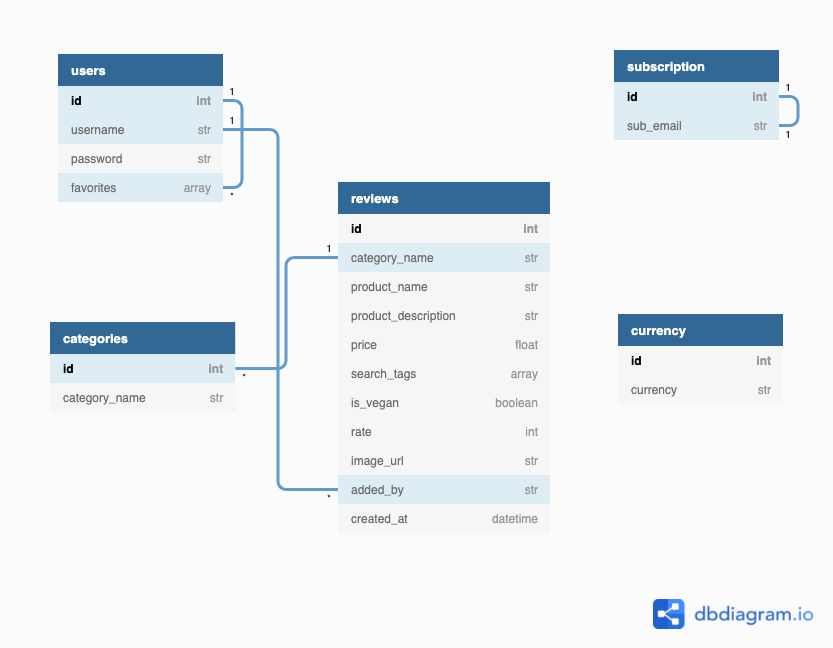

<link rel="stylesheet" href="https://use.fontawesome.com/releases/v5.6.1/css/all.css" integrity="sha384-gfdkjb5BdAXd+lj+gudLWI+BXq4IuLW5IT+brZEZsLFm++aCMlF1V92rMkPaX4PP" crossorigin="anonymous">
<h1 align="center">Skincare confessions <i class="fas fa-leaf"></i></h1>

### Overview
_The aim of this project is to combine my current knowledge in HTML, CSS and JavaScript with what I've been able to learn from the back end development process of making an application. Main purpose of this project is to utilize Python programming language integrated with MongoDB and Flask framework, to create a database for storing and retrieving data efficiently. As such I have decided to create the following skincare review site, which allow users to create, read, update and delete (CRUD) reviews/data.
'Skincare confessions' is an open source application for all to use but would consider skincare and beauty enthusiasts the main target audience. Passionate to discover and explore new brands, share or perhaps keep track and store own favorite brands._

---
 ## User Experience 5 Planes (UX)
  ### The Strategy Plane
  - 'Skincare confessions' website is designed to be obvious its purpose with the user experience kept front-in-mind. A combination of modern and minimalist design approach with simple intuitive structure, making it easy for users to quickly adapt and allure them to keep coming back. The website application will be built with a mobile first approach because of its simplicity and light content also taking into consideration that the majority of our audience most likely will be browsing online using a smartphone device because of 21st century convince.
  'Skincare confessions' enables access to all the reviews that's been published on the site even for non-registered users. With an additional function to subscribe to a newsletter keeping the user updated and engaged in what’s happening in the skincare community. At the same time however it gives the opportunity to create an account and benefit from the perks of having access to all features available on the website. Apart from being able to add, share, edit and delete their own reviews registered users are also able to save their favorite reviews.
  
- ### User stories ###

   - _"As a **user**, I'd like to effectively browse and read through posted reviews that I'd be keen to learn more about or even might purchase."_

   - _"As a **user**, I'd like to be able to create my own account
."_
   - _"As a **user**, I want to access the website from any device (mobile, tablet, laptop and desktop)"_

   - _"As a **user**, I want to review a product so that I can share my own experiences with others but also keep as reminder for self"_
 
   - _"As a **user**, I want to update a review if for instance I have made a spelling mistake or perhaps my opinion has changed."_
 
   - _"As a **user**, I'd like to be able to remove reviews I have created, if no longer relevant"_
 
   - _"As a **user**, I'd like to be able to quickly search the site to find a specific item."_
 
   - _"As a **user**, I'd like to categorize my entries to easier locate a specific item in case I forget the product name. _"

   - _"As a **user**, I'd like to mark reviews I want to preserve. _"

   - _"As a **user**, I want to be able to upload images of what I review, so that it is easier to associate the actual item with item name/description."_

- ### Site Owner Goals ###

    - _"As **site owner**, I want to connect like-minded individuals and give them the opportunity come together and share their experiences. "_

    - _"As **site owner**, I would like to collect users e-mail addresses for newsletters to expand the community."_
 
    - _"As **site owner**, I want to raise awareness of the organization and clarify its mission."_
 
    - _"As **site owner**, I want my application to become the number 1 search engine for skincare reviews."_

     - _"As **site owner**, I want a simple visually appealing application easy to use across various screen devices."_

**Below is a table depiction of site feature opportunities evaluated in terms of importance for the organization and measuring of how realistic the features are to implement &#40;viability and feasibility&#41;. Measured on a scale of 1 &#91;least&#93; - 5 &#91;most&#93;.**

| Opportunity                                 | Importance | Viability / Feasibility |
| :------------------------------------------ | :--------: | :---------------------: |
| Create an Online Presence                   |     5      |            5            |
| Register                                    |     5      |            5            |
| Login / Logout                              |     5      |            5            |
| Create / Update / Delete Reviews            |     5      |            5            |
| Responsiveness                              |     5      |            4            |
| Search Reviews By Keywords                  |     4      |            5            |
| Show Reviews By Category                    |     4      |            5            |
| Subscribe To Newsletter                     |     4      |            4            |
| Manage Review Category &#40;Admin only&#41; |     3      |            5            |
| Page 404                                    |     3      |            5            |
| Image Upload For Each Review                |     4      |            2            |
| Pagination                                  |     3      |            3            |
| Rating of Reviews                           |     3      |            3            |
| “Like” Reaction on Reviews                  |     2      |            2            |
| Resetting Password When Users Forget It     |     5      |            2            |

### The Scope Plane

The essential functional specifications and content for the website which are outlined below were determined based on users and site owners wants and needs, so the site will deliver specific for its intended use. 

**Features & Content this project will include;**

- All pages
   - A simple navigation bar containing site overview list, allowing users to easily navigate across the different site pages. On smaller resolution devices such as mobile, tablet the navbar is collapsed into a burger drop down menu, providing a cleaner aesthetic and better user experience. A side bar navigation appears when the burger icon is clicked. 
   - Footer which features links to social media channels opening in new window tabs.

- Registration page which allows a user to create a personal account choosing username and password. Below the form is a link re-directing to the login page for existing users. For the account to be created, all fields must pass validation:
   - Username must be between 3 and 15 characters
   - Password must be at least 8 characters
   - Confirm password field should match the password field

- Login page features the form with "username" and "password" fields which must be filled and match the ones in the database to access users personal account. If entered inaccurately when submitted a flash message will display an error description, to alert user. A link below form will help re-direct already registered users to login page.

- Logout link button will end user session and redirect to the homepage.

- Subscription function collecting users e-mail addresses for users interested in receiving newsletter updates.

- Manage categories page for authorized admin use only, to create update and delete category list display.

- Create / Update / Delete functions;
   On users Add Reviews page is where personal reviews are created. Ones all the criterias on the validation form are meet the review can be added;

   - Product category of review must be selected 

   - Product brand that's being subject of the review is required, must be between 1 and 25 characters.

   - A Product description is required and must contain between 10 and 2000 characters.

   - Product cost will be required information
   
   - Reviews must be rated a score between 1 and 5 star icons.

   - There will be the option to upload an image. If a review is added without an image, a default image will be adapted.

   - Search tags will be optional to add 

   - On users My Review page they are able to view all their entries, would they however want to make a new entry then there will be an add button which would re-direct to the Add Review page. Otherwise if user wishes to make modifications there will also be an Edit button available which would re-direct user to their personal edit page, where same validation form as in add review page will be displayed. A message will appear confirming the success or failure of the update made. If a user wishes to delete their entry there will also be a delete button presented on the My reviews page, the review will only be deleted ones the user respond to the confirmation dialog box.

- Pagination will be another existing feature on the website as the community grows and the number of reviews increases this will improve the user experience. 

- 404 page that appears for invalid URL directing users back to Home page will be provided.

- Reset Password function that enables users who happen to forget their password the opportunity to re-new it.

- The informative content that will be present on the website are;
   - Text presentation about the web application and text description of each user review.
   - Images (hero image, logo, product images) will appear on site as well. 
   - Icons signalmen that provides predictability.

### The Structure Plane

The main focus of the structure plane is how users recive and get to specific information on the website.

- Using the navigation bar conviniently placed top of website, users can easily navigate the website to find what they are interestend in. 

- For a more specific & qucik search, on the Browse Reviews and My Reviews collection page users can also opt to use the search bar adapting keywords matching their specific quest.

- Pages available for public display are Home, Browse Reviews, Register and Login.

- To access full site features such as adding, updating and deleting own reviews also having access to a personal review collection page user will have to register and sign in.

- Note Admin user account has additional access to Manage Categories page.

-  To not overwhelm the user, text information is keept brief with focused content information. Attention grabbing and descriptive imagery objects also incorporated on the site (e.g logo). Connection points are provided via links to Social Media in Footer. 

- Page 404 that appears for invalid URL directing users back to Home page. Design structure similar to the other website components so that the layout remains consistent and user finds familiarity.

- Full description of a review post are accessible by any user on Review details page which renders when a user clicks on a post. 

Below is a chart of the database structure showing the collections that will be retaining documented data. 
> **Note:** 
> Chart constructed before site develpoment process using [dbdiagram.io](https://dbdiagram.io) 

