[Chrome DevTools](https://developers.google.com/web/tools/chrome-devtools) - Tool consistently used to identify issues arising and to test changes made throughout site development to ensure web application desired appearance and functionality.

[W3C Markup Validator](https://validator.w3.org/)- Used to validate HTML; No errors found, only warnings implying to the Jinja formatted context.

[W3 CSS Validation Service](https://jigsaw.w3.org/css-validator/#validate_by_input) - Used to validate CSS; No errors found, warnings only implying the use of css prefixes.

[JSLint](https://jslint.com/)- Used to validate Javascript code no major errors found, only warnings in regards to syntax useage(such as using double qoutes, parens around ternery operator & adjusting too long lines)

[Lighthouse](https://chrome.google.com/webstore/detail/lighthouse/blipmdconlkpinefehnmjammfjpmpbjk?hl=en) - Used to test the performance of the application on desktop & mobile.

### Issues and Resolutions

**Errors encountered and resolved during development process**

- First encounter was when trying to display the nav links depending on the user being signed in or not. As my first encounter adapting backend logic to display frontend, I had to do a little reading research to fully understand what needed to be done. Turns out the fix was very simple actually, I would have to create a session object to grab the username from database. Once the user has created an account their username is placed in session cookie and each time user tries to log in it's compared to username found in database. Thereafter, to render the response from backend onto frontend, curate a jinja statement checking if the session user can be found. To get the accurate display you place the content you want to be viewed when user is signed in or not within the if else statement.

- Another error occurred when trying to submit the review form with user inputs using the request.method=='POST'. The form would at such point always submit successfully even knowing input requirements actually had not been meet. This problem occurred because the form was not being validated. To make sure the form validations where being checked prior to submission I'd use WTForms library helper validate_on_submit(). The decimal limitation mystery is not as mysterious as in early on. It is still unsolved, but I believe could have been resolved through creating own context processor for the DecimalField to convert the data values in order to be able to modify them in the most accurate way. However current solution adopts the use of Float field. It isn't as precise in calculation as decimal128 but works to edit and update the review form. I've tried to configure the float value to only show 2 decimal values by using round() method but that would only round to the nearest integer value. Hence, have left it as float only.

- The function meant to render the default image, if no image file had been input by user has a particular set up. In the way that the upload img file data is being retrieved from the file filed whilst the default img is actually rendered in html using img tag. However for this instance I've had to use request.form.get in the route logic so the if else statements return accurate response but this shouldn't be a necessity since the default img url is not being sent & stored in db.

- In regard to the star rating js function determining the coloring depending on rate choice, the first star wouldn't turn yellow on click, so I had to adjust the code using more specific selectors for the css styling to work.

- When adapting the flask wtf file field it comes with a default button which can't be manipulated on its own. Therefore to get the appearance/outcome I wanted I had to create my own custom button to cover the default one provided.

- At some point I had removed the form-control class from the star rating logic, this was a mistake. Because the form control serves as the point of connection between client side and server side handling. A user is able to interact with a form component inputting data that can be sent to server for further processing. It can also affect styling which in this case it did with the star rating field error message positioning.

- The submit event on the add review form was clashing with an attribute with similar (name &/or I'd), ending up not submitting the form. This bug was fixed using the HTMLFormElement.prototype.submit.call() method, which submits the (specified) given form element. 

- The html code for the subscription form had a couple of syntax issues at first. One being that I had missed adding the csrf_token, a unique token generated different each time the web page is served. To prevent from malicious web attacks pursuing sensitive user information. The second issue was that I had misplaced the form tag elements.The invalid-feedback bootstrap validation as per requirement needs to be a direct sibling of the input control to display, hence the adjustment made.

- With the tag input field I was having trouble only creating tags which contained written context, removing any white space symbol as sole input. This however i managed to overcome by replacing(replace() method) any white space symbol with an empty string & then checking tag len making sure its greater than the value 0.

- Another situation causing trouble was an indentation slip causing the default img on edit form not to update. Once formatted correctly the default img which had been entered could be altered & the route logic retrieved accurately.

- An unresolved issue would be the layout of the short description on each review card. The idea was to have it display as an ellipsis with the text content wrapping two rows instead of current display wrapping one.

### Lighthouse performance
Following findings were made during lighthouse performance testing;

**Accessibility**

<strong>Home Page</strong>

 ➤ Aria-label was missing on the burger menu button. For accessibility purposes to enhance the experience for users of assistive technology this has been corrected.

 ➤ Heading elements altered to display in sequentially-descending order. Providing proper semantic structure making it easier Properly ordered headings that do not skip levels convey the semantic structure of the page, making navigation easier when depending on assistive technologies.

 ➤ Aria-label added to links where link text would not be appropriate, to distinguish and improve focus on the navigation experience for users depending on assistive technologies.

 ➤ Form element containing the heart icon favorite checkbox was missing the associated labels meant for improving accessibility for users depending on assistive technology.

Before status result was at 70% after alteration Accessibility improved to 100%.

<strong>About Page</strong>

➤ Heading elements are not in a sequentially-descending order, reason being to achieve a certain layout. Unable to adjust the heading sizing using css, therefore will have to mend in future application.

Accessibility status result 98%

<strong>Browse reviews Page</strong>

Accessibility status result 100%

<strong>My reviews Page</strong>

Accessibility status result 100%

<strong>Add reviews Page</strong>

➤ The Skincare category drop down menu didn't have a sufficient contrast ratio between background and foreground color.

➤ File field & star rating field elements do not have associated labels. For future implementation find a way to implement aria-label onto jinja generated template.

➤ Star rating ID values seem to be getting mixed up & unidentifiable because it seems to have very similar instances. Leading to issues where its being overlooked by assistive technologies. 

Before status result was at 81% after alteration Accessibility improved to 84%.

<strong>Login Page</strong>

Accessibility status result 100%

<strong>Register Page</strong>

Accessibility status result 100%

<strong>Individual view Page</strong>

Status result 100%

<strong>Edit review Page</strong>

➤ File field & star rating field elements do not have associated labels. For future implementation find a way to implement aria-label onto jinja generated template.

➤ Star rating ID values seem to be getting mixed up & unidentifiable because it seems to have very similar instances. Leading to issues where its being overlooked by assistive technologies. 

Status result 84%

<strong>Browse reviews Page</strong>

Status result 100%

**SEO**

 ➤ The meta name="description" element which provides a summary of an application page content, when added can increase search traffic to application & has therefor been added.

Before status result was at 92% after alteration SEO improved to 100%.

<strong>About Page</strong>

➤ Footer social media links appears to be inaccurate. Need to be large enough (48x48px), and have enough space around.

Status result at 95%.

<strong>Browse reviews Page</strong>

➤ I had to reform my active pagination link so that Google search engine could easily crawl, in other words follow my link. For this I had to add the href attr with a resolvable URL.

Before status result was at 92% after alteration SEO improved to 100%.

<strong>My reviews Page</strong>

➤ I had to reform my active pagination link so that Google search engine could easily crawl, in other words follow my link. For this I had to add the href attr with a resolvable URL.

Before status result was at 92% after alteration SEO improved to 100%.

<strong>Add reviews Page</strong>

➤ Star rating radio field options appears to be inaccurate. Need to be large enough (48x48px), and have enough space around to easily enable click.

Status result at 96%.

<strong>Login Page</strong>

➤ Footer social media links appears to be inaccurate. Need to be large enough (48x48px), and have enough space around.

Status result at 95%.

<strong>Register Page</strong>

Status result at 100%.

<strong>Individual view Page</strong>

Status result 100%

<strong>Edit review Page</strong>

➤ Footer social media links appears to be inaccurate. Need to be large enough (48x48px), and have enough space around.

Status result 96%

<strong>Search review Page</strong>

➤ Footer social media links appears to be inaccurate. Need to be large enough (48x48px), and have enough space around.

Status result 94%

**Best practices**

 ➤ To not expose the application to malicious security attacks and performance issues when linking to a page on another site using the target="_blank" attribute, rel="no opener" has been added.

 ➤ Images displayed with incorrect aspect ratio, is an issue yet to be resolved. When explicit width & height is set it appears that it can disturbe (the natural aspect ratio). Which in turn may have the rendered image look distorted.

Before status result was at 63% after alteration Best practices improved to 87%.

<strong>About Page</strong>

Status result 100%

<strong>Browse reviews Page</strong>

 ➤ Images displayed with incorrect aspect ratio, is an issue yet to be resolved. When explicit width & height is set it appears that it can disturb (the natural aspect ratio). Which in turn may have the rendered image look distorted.

Status result 93%

<strong>My reviews Page</strong>

 ➤ Images displayed with incorrect aspect ratio, is an issue yet to be resolved. When explicit width & height is set it appears that it can disturb (the natural aspect ratio). Which in turn may have the rendered image look distorted.

Status result 93%

<strong>Add reviews Page</strong>

Status result 100%

<strong>Login Page</strong>

 ➤ Images displayed with incorrect aspect ratio, is an issue yet to be resolved. When explicit width & height is set it appears that it can disturb (the natural aspect ratio). Which in turn may have the rendered image look distorted.

Status result 93%

<strong>Register Page</strong>

 ➤ Images displayed with incorrect aspect ratio, is an issue yet to be resolved. When explicit width & height is set it appears that it can disturb (the natural aspect ratio). Which in turn may have the rendered image look distorted.

Status result 93%

<strong>Individual view Page</strong>

 ➤ Images displayed with incorrect aspect ratio, is an issue yet to be resolved. When explicit width & height is set it appears that it can disturb (the natural aspect ratio). Which in turn may have the rendered image look distorted.

Status result 93%

<strong>Edit review Page</strong>

Status result 100%

<strong>Search review Page</strong>

Status result 100%

**Performance**

 ➤ Implement explicit width and height to image elements.

Before status result was at 53% after alteration Performance improved to 61%

<strong>About Page</strong>

➤ Implement explicit width and height to image elements.

Before status result was at 69% after alteration Performance improved to 89%

<strong>Browse reviews Page</strong>

Status result 67%

<strong>My reviews Page</strong>

Status result 50%

<strong>Add reviews Page</strong>

Status result 90%

<strong>Login Page</strong>

➤ Implement explicit width and height to image element.

Before status result was at 87% after alteration Performance remain at 87%

<strong>Register Page</strong>

Status result 78%

<strong>Individual view Page</strong>

➤ Implement explicit width and height to image element.

Before status result was at 70% after alteration Performance improved to 76%

<strong>Edit review Page</strong>

Status result 89%

<strong>Search review Page</strong>

Status result 82%

> **Note:**
> For future reference common elements that could be improved to enhance site performance are shown in the image below;

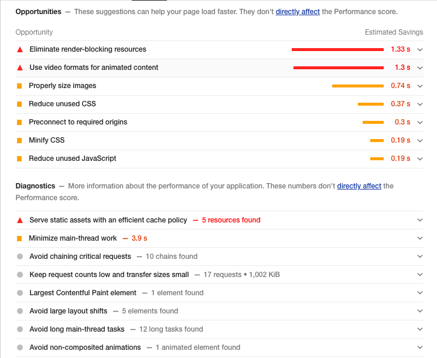

### Manual testing
 
Following elements were tested to ensure web application functioning accurately.

- **Mutual content;**

 ➤ Top navbar logo clicked to make sure link re-directs to home page. (Sidebar logo excluded)
 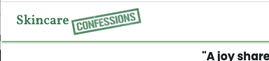

 ➤ Navbar menue alternatives clicked to make sure they all got the hover grow effect and also redirect each to their own designated pages. Cursor also makes a switch to pointer.

   <strong>Sidebar</strong>
  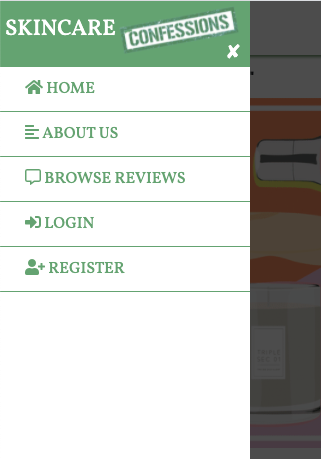
  <strong>Topnav</strong>
  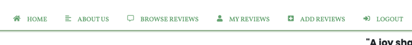

 ➤ Screen size resized to make sure burger icon display the sidebar menu rather then the top nav options. On click sidebar transitions into screen view. Cursor transforms to pointer when mouse enters the burger icon area.
 

 ➤ Overlay appears when burger icon is pressed covering the browser content, except for the sidebar. Click anywhere on the overlay will close/retract the sidebar. X mark icon on sidebar top corner will also have the same effect close/retract the sidebar.
 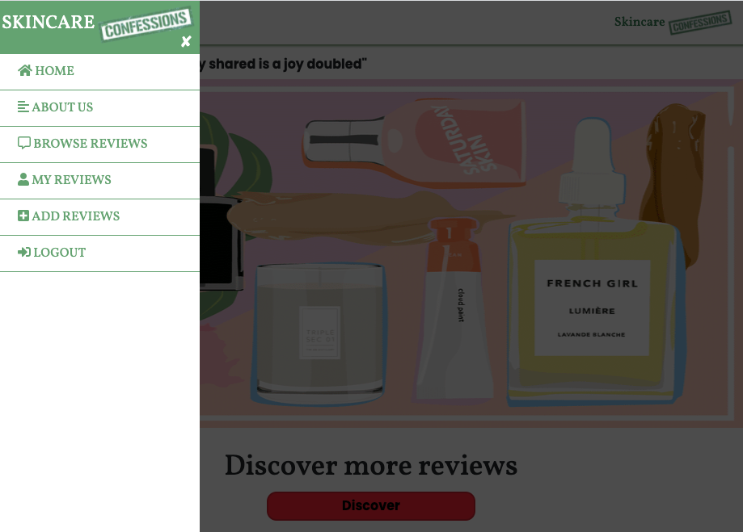

 ➤ Social media icon links opens in a new tab browser when clicked. Cursor transforms to pointer.
 

 ➤ When hovered over footer text, cursor transforms to default.

- **Home Page;**

 ➤ Discover button cursor transforms to pointer when mouse enters and redirects to browse reviews page when pressed. Grow effect gets triggered when hovered over.

 ➤ Review cards redirect to their individual view page when clicked anywhere within its frame. Exception the heart icon, which only alters the color fill in & state of value being sent to db. When hovered over an animation slightly lifts the card up. Cursor transforms to pointer. Review card display on the page is a 4 card layout, on page refresh the cards vary & displays at random.

 ➤ Subscribe input field on focus or clicked border color gets filled in. Cursor transforms to text.

 ➤ Subscription button cursor transforms to pointer when mouse enter link button area.

 ➤ On focus above mentioned objects outlined.

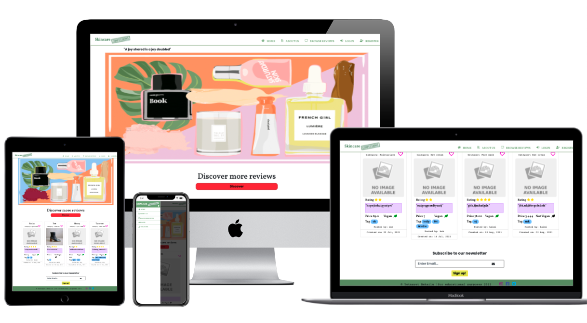
- **About us Page;**

 ➤ Subscribe input field on focus or clicked border color gets filled in. Cursor transforms to text.

 ➤ Subscription button cursor transforms to pointer when mouse enter link button area.

 ➤ The text div containing the introduction paragraphs has been made scroll able when screen size become to small to properly display all the text in view. 

 ➤ On focus above mentioned objects gets outlined for improved accessibility.

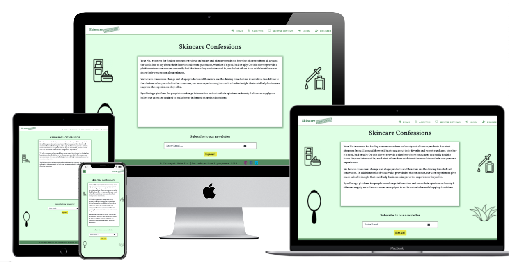

- **Browse reviews Page;**

 ➤ Review counter which tells the total amount of reviews that has been posted, is rendered as head title. To check that it works insert a new review post to see that the counter counts accurately.

 ➤ Review cards redirect to their individual view page when clicked anywhere within its frame. Exception the heart icon, which only alters the color fill in & state of value being sent to db. When hovered over an animation slightly lifts the card up. Cursor transforms to pointer.

 ➤ Search bar when clicked or on focus expands. Cursor transforms to text & field gets outlined. To quickly clear input text user is able to press the x-mark icon.

 ➤ On hover, over pagination cursor transforms to pointer. When clicked the activated pagination gets a border to enhance the current page being displayed. Review card display on pages per pagination is a 12 card view(the latest entry to last order).

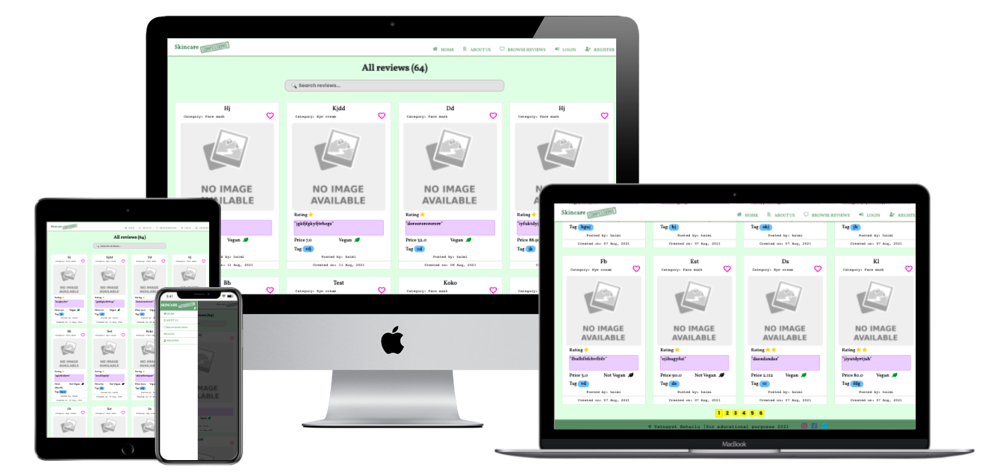
- **My reviews Page;**

 ➤ Personal review counter which tells the total amount of own individual reviews that has been posted, is rendered as head title. To check that it works insert a new review post to see that the counter counts accurately. Includes signed in user's username in front of it, to make sure it's rendered accurately user must be signed in to view.

 ➤ Search bar when clicked or on focus expands. Cursor transforms to text & field gets outlined. To quickly clear input text user is able to press the x-mark icon.

 ➤ Review cards redirect to their individual view page when clicked anywhere within its frame. Exception the heart icon, which only alters the color fill in & state of value being sent to db. When hovered over an animation slightly lifts the card up. Cursor transforms to pointer. Review card display on pages per pagination is a 12 card view(the latest entry to last order).

 ➤ On hover, over pagination cursor transforms to pointer. When clicked the activated pagination gets a border to enhance the current page being displayed.

 ➤ Add new review button cursor transforms to pointer when mouse enters and redirects to add reviews page when pressed. Grow effect gets triggered when hovered over.
 
 * Note that my reviews page has the same layout as browse reviews, with the single difference that it only displays the users personal reviews & there being an add new review link button as displayed below.

- **Individual view Page;**

 ➤ The edit button on the individual view for the review, is only displayed for the user whom is signed in & has written the post. This allows for only the writer of the review to edit the entry. When hovered over triggers the grow effect & when clicked re-directs to the edit review form page.

 ➤ The delete button on the individual view for the review, is only displayed for the user whom is signed in & has written the post. This allows for only the writer of the review to remove the entry. When hovered over triggers the grow effect & when clicked deletes the review from database.
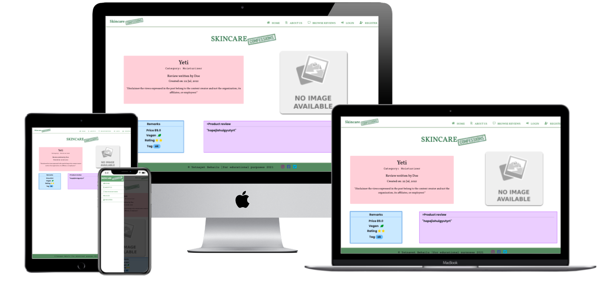
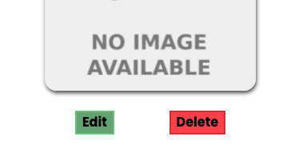

- **Search reviews Page;**
 
 ➤ Search result page is rendered when user has entered input & submitted via clicking enter on keyboard. Current status the user is able to enter an empty field & render the results page however with obvious zero result, (this will need to be fixed at another time).
 * Note that search result page has the same layout as browse reviews, with the single difference that it only displays review cards which has the same value as the search bar input.
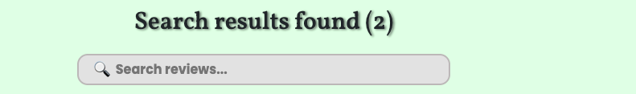

- **Add reviews Page & Edit review Page;**

 ➤ Signed in user username is displayed as head title to make sure it's rendered accurately user must be signed in to view.

 ➤ Select field when clicked displays a list of alternatives for users to choose from. To mark that it has been clicked or is in focus it has been given a colored box-shadow.

 ➤ String field, textareafield & booleanfield on click & or focus receives a border and background color to emphasize it has been selected.

 ➤ Float field receives border color on click.

 ➤ Radio field stars when clicked receives color filling or has its color removed depending on clicks.

 ➤ File field outlined on click/focus

 ➤ Tag done button submits the tag inputs inserted to field & generates the tags. 

 ➤ Add & Cancel button on hover receives borders and pulsing hover effect is triggered. Add button on click submits form data & redirects to browse reviews page if all fields pass the validation requirements. Otherwise, error message alerts user on what needs to be done. Whilst cancel button refreshes and renders the same page.

 ➤ Note on edit review form when page renders then some of the fields are pre-filled (for convenience). Pre-filled fields are Skincare Category, Brand Name, Product Review, Price & Vegan. 
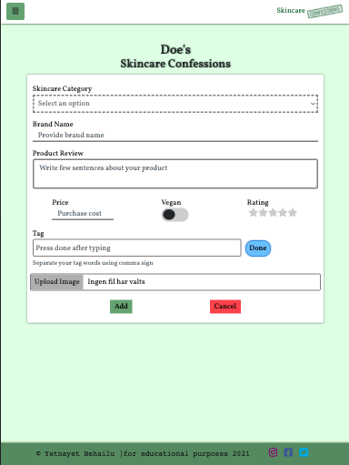

- **Logout;**

 ➤ To be able to logout user has to be logged in first. Logout button can then be found on either the topnav or sidenav, which on click will automatically sign out user & render the login page.

- **Login Page;**

 ➤ Visible for users who are not signed in to an account.

 ➤ Stringfield inputs on click/focus receives border & background color.

 ➤ Login button on click validates login form, if all fields pass the validation requirements user gets redirected to home page reciving a flash message. Otherwise, error message alerts user on what needs to be done.

 ➤ Below the login button a link which on click redirects to register page can be found. This is meant for new user who are not already members to register for an account.

- **Register Page;**

 ➤ Visible for users who are not signed in to an account.

 ➤ Stringfield inputs on click/focus receives border & background color.

 ➤ Sign up button on click validates register form, if all fields pass the validation requirements user gets redirected to home page receiving a flash message. Otherwise, error message alerts user on what needs to be done.

 ➤ Below the sign up button a link which on click redirects to login page can be found. This is meant for user who already are signed up members with an account.

- **404 Page;**

 ➤ If user ends up on the 404 page, as an example having written incorrect url then there is a home link button center of that page meant to help user direct back to home page(on click). When hovered over it triggers a pulsating effect, to grab the user's attention.
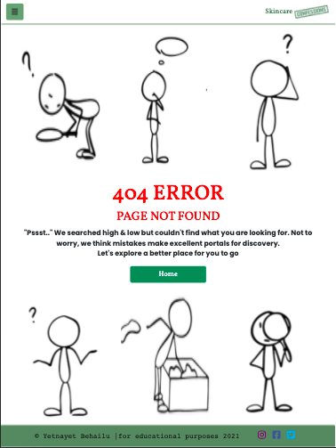

### Web application tested on following devices.
- iPad

- Moto G4

- iPhone 5/SE,6,7,8,11,X,PLUS 

- 13" Mac book air

- Galaxy s9

- Medium screen 1024×800

- Large screen 1280x 800

### User Stories Validation

* For users to quickly & easily find reviews that they are looking for the review cards are being displayed on various pages of the app. The user is always able to navigate to desired page using the navbar menu alternatives. Browse reviews is a whole page dedicated to listing all user entries. Whilst My reviews page is a personal page where all the user individual review posts are collected, mainly for convenience to edit own posts. Home page displays a preview of (4) review cards which changes display at random on page refresh. Would user be tempted to see more, there's a discover button right above which re-directs user straight to browse reviews page. Would the user be looking for a specified review there's a search bar on browse reviews page, my reviews page & search_reviews page that allows user to type in keyword/keywords of what they are looking for. The results will show on the last mentioned page.

* Users who would like further access to application features are able to create their own personal account.

* Application has been created to be accessible from mobile, tablet, laptop and desktop devices. Constructed as a responsive web-site with mobile-first approach.

* Only users with an account are able to make a review post as well as manage, update & delete (their individual review entries) as desired. Whilst all review entries can be found on the browse page, signed in user has also got the option to render their own personal page containing all of their written reviews.

* To offer a better user experience search bar implementation has been curated. Enabling users to quickly be able to search the site to find a specific item, by inputting keyword/keywords into the field.

* User entries are categorized however individual pages for each category type has not been made & will be left for future implementation.

* For signed in users there is the opportunity to favorite reviews one would like to preserve. This is done by clicking the heart icon which can be found on each review card. This is to offer each user a more personalized experience. 

* Signed in users are also able to upload image files as part of their review posts. Providing a greater visual support & appeal. Making it easier to associate the actual item with item name/description. If left out a default image is chosen to take its place.

### Site owner Stories Validation
* Skincare confessions' application was made to serve as a meeting hub for people whom share a common interest, which would be skincare/beauty. For this purpose users are able to interact with one another by sharing their own personal experiences. For further connection external links associated to social media accounts is provided(at footer), for users to connect with a large community outside the application as well.

* Subscription option implemented for users to leave their contact information for further correspondence with the organization & vice versa.

* Providing an About Us page section where users will find all essential information about the organization and the work performed. Content is kept short and simple to not overwhelm user.

* With the generated user reviews the organization hopes to become a great industry influencer & the number 1 search engine for skincare reviews.